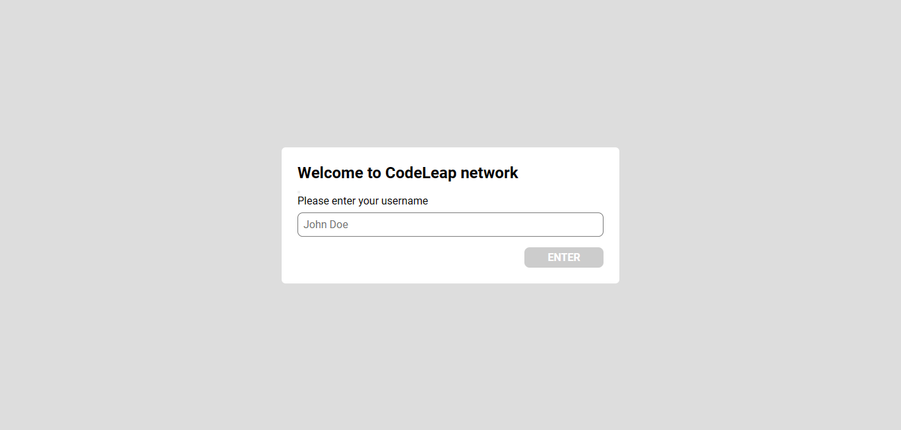
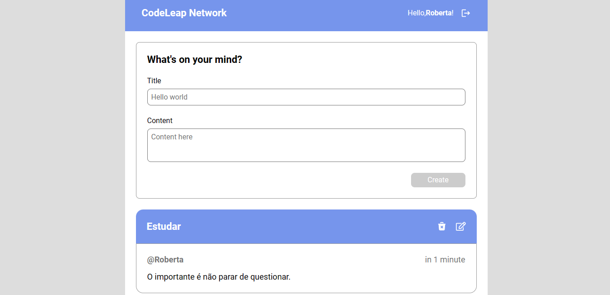
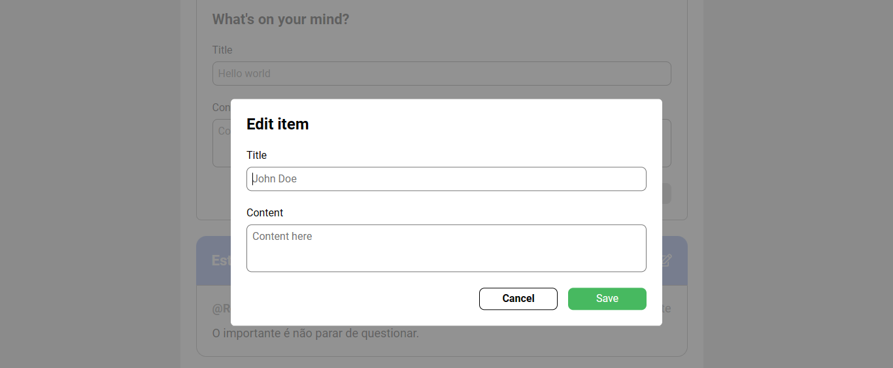
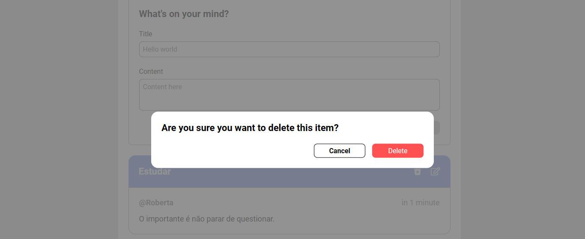
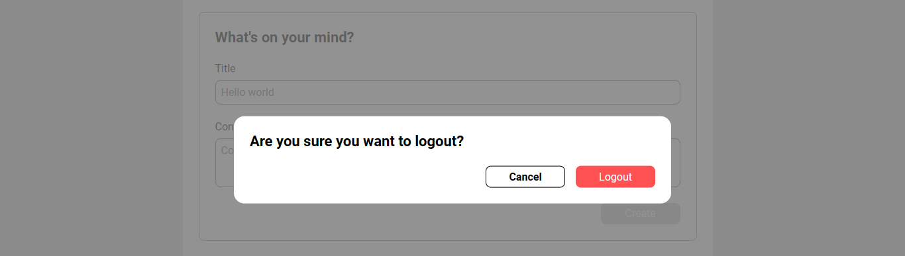
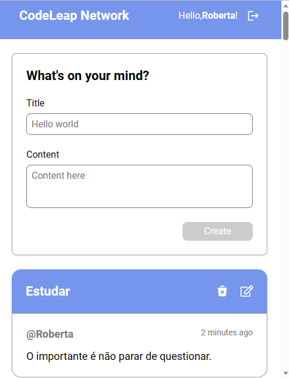

<h1>CodeLeap Network</h1>

 <h2><a href=''>Acesse o projeto</a></h2>

## 📝Descrição

Este projeto foi desenvolvido para empresa CodeLeap. O objetivo era criar um aplicativo estilo Twitter, baseado no design fornecido pelo Figma.

### ✅Funcionalidades:
- Login/logout permanente
- Criar postagens
- Editar postagens
- Excluir postagens
- Pergaminho Infinito

### 🚀Tecnologias utilizadas:

- ReactJs
- Axios 
- Styled Components 
- Typescript 
- Redux 
- Redux Toolkit
- React Hook Form 
- Zod 
- Vite 

[Roberta Vieira de Melo](https://github.com/VieiraMeloRoberta)